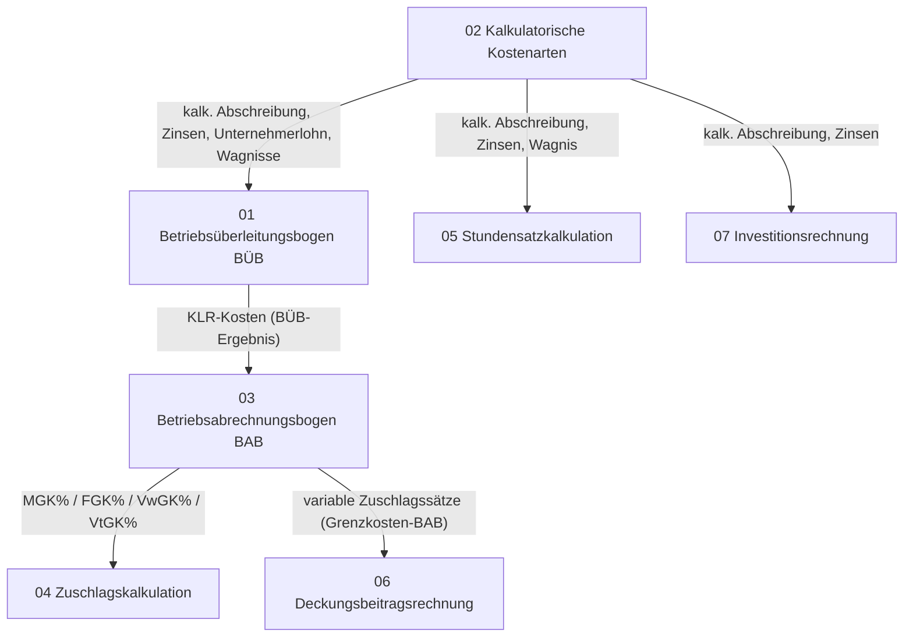
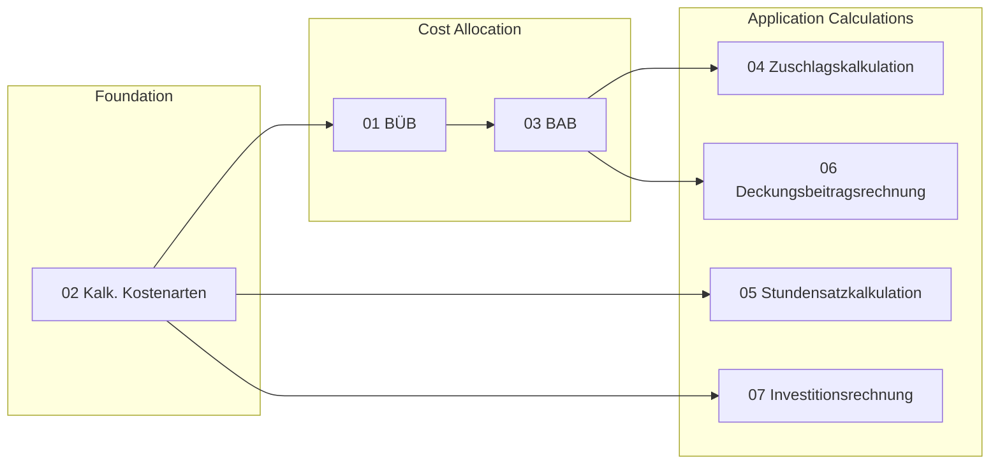

# Calculation Dependencies

> **Purpose:** Shows which calculation tables depend on which, and which inputs flow between them.

---

## Dependency Graph

---

## Detailed Dependency Map

| # | File | Depends On | Provides To |
|---|------|------------|-------------|
| **01** | **Betriebsüberleitungsbogen (BÜB)** | — Procedure for converting P&L expense → KLR cost. Uses formulas from [[#02]] for each imputed cost type. | KLR cost values → [[#03]] BAB |
| **02** | **Kalkulatorische Kostenarten** | — Foundation. Defines *how* to compute each imputed cost type (Abschreibung, Zinsen, Unternehmerlohn, Wagnisse). | Formulas + values → [[#01]], [[#05]], [[#07]] |
| **03** | **Betriebsabrechnungsbogen (BAB)** | KLR costs from [[#01]] (post-BÜB). Distributes overhead to cost centers, derives surcharge rates. | Surcharge rates → [[#04]]; Variable rates → [[#06]] |
| **04** | **Zuschlagskalkulation** | [[#03]] (MGK%, FGK%, VwGK%, VtGK%). Also references [[#02]] indirectly via BAB. | Product/service cost calculation (self-contained output) |
| **05** | **Stundensatzkalkulation** | [[#02]] (kalk. Abschreibung, kalk. Zinsen, kalk. Wagnis). | Hourly/daily billing rate (self-contained output) |
| **06** | **Deckungsbeitragsrechnung** | [[#03]] (variable surcharge rates from Grenzkosten-BAB). | Break-even, make-or-buy, product mix decisions (output) |
| **07** | **Investitionsrechnung** | [[#02]] (kalk. Abschreibung, kalk. Zinsen — both used in Kostenvergleichsrechnung). | Investment viability decision (output) |

---

## Dependency Layers

### Layer 0 — Foundation
- **02 Kalkulatorische Kostenarten** — The mathematical core. Every other table either directly references it or builds on its outputs. No other table feeds into it.

### Layer 1 — Cost Allocation
- **01 Betriebsüberleitungsbogen (BÜB)** — Applies the formulas from [[#02]] to convert P&L data into KLR costs.
- **03 Betriebsabrechnungsbogen (BAB)** — Takes the resulting KLR costs and distributes them across cost centers to produce surcharge rates.

### Layer 2 — Application Calculations
- **04 Zuschlagskalkulation** — Applies BAB surcharge rates to determine product/service costs.
- **05 Stundensatzkalkulation** — Uses imputed costs directly from [[#02]] to calculate hourly billing rates.
- **06 Deckungsbeitragsrechnung** — Uses the variable-cost variant of BAB (Grenzkosten-BAB).
- **07 Investitionsrechnung** — Uses imputed cost formulas from [[#02]] for investment appraisal.

---

## Dependency Chains (Shortest Paths)

| Calculation | Required Prerequisites (in order) |
|-------------|-----------------------------------|
| **04 Zuschlagskalkulation** | 02 → 01 → 03 → 04 |
| **05 Stundensatzkalkulation** | 02 → 05 |
| **06 Deckungsbeitragsrechnung** | 02 → 01 → 03 → 06 |
| **07 Investitionsrechnung** | 02 → 07 |

> **Note:** 01 (BÜB) and 02 (Kalk. Kostenarten) are tightly coupled — BÜB explains *when* to adjust, Kalk. Kostenarten explains *how* to calculate the adjustment. They should be studied together.
